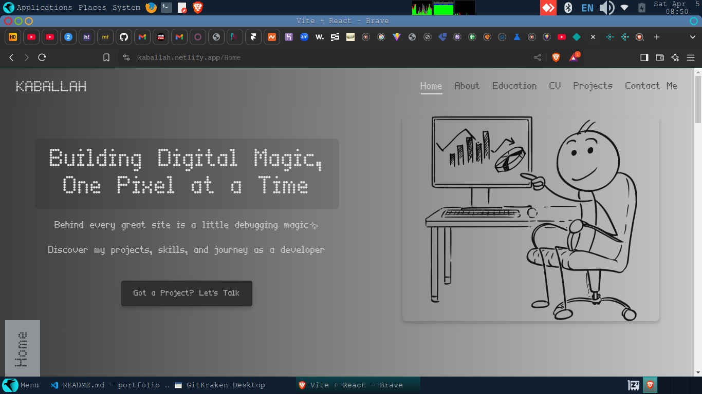
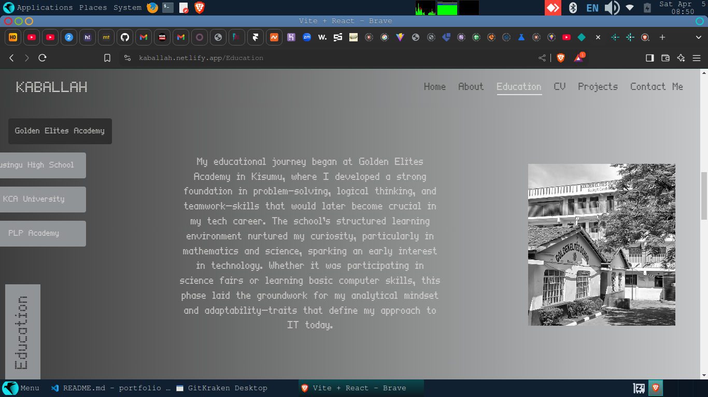
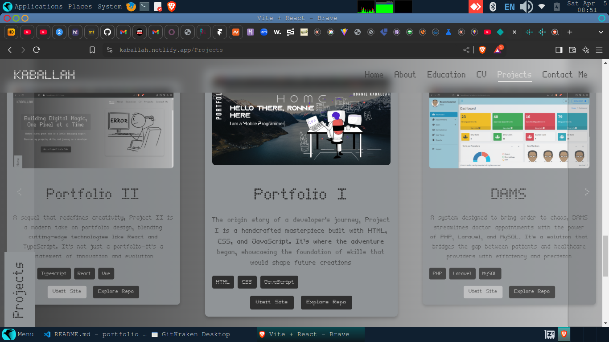

# Portfolio Website 🚀
Welcome to my portfolio website repository! This project showcases my skills, projects, and journey as a developer through an interactive and responsive web application built with React.


## 🌐 Live Demo
Visit my portfolio: [kaballah.netlify.app](https://kaballah.netlify.app)


## ✨ Features
* 🎨 Modern and clean design
* 📱 Fully responsive layout
* 🌗 Smooth animations and transitions
* 📬 Working contact form with EmailJS
* 💬 Direct WhatsApp integration
* 🔗 Social media integration
* 📂 Project showcase with live demos


## 🛠️ Technologies Used
1. React.js
2. CSS3 (Custom styling)
3. EmailJS
4. React Icons
5. Netlify (Hosting)


## 📸 Screenshots
<details> <summary>Click to expand!</summary>
    






</details>


## 🎯 Key Components
- Responsive Design Example
```
<meta name="viewport" content="width=1000" />
```

- WhatsApp Integration
```
const generateWhatsAppLink = () => {
    const phoneNumber = "254769692554";
    const message = encodeURIComponent("Hi! I saw your portfolio and would like to connect.");
    return `https://wa.me/${phoneNumber}?text=${message}`;
};
```

- Contact Form with EmailJS
```
const sendEmail = (e) => {
    e.preventDefault();
    emailjs.sendForm(
        'YOUR_SERVICE_ID',
        'YOUR_TEMPLATE_ID',
        formRef.current,
        'YOUR_USER_ID'
    ).then(
        (result) => {
            alert('Message sent successfully!');
        },
        (error) => {
            alert('Failed to send message. Please try again.');
        }
    );
};
```


# 🚀 Getting Started
1. Clone the repository
```
git clone https://github.com/kaballah/portfolio-kaballah.git
cd portfolio-kaballah
```

2. Install dependencies
```
npm install
```

3. Start the development server
```
npm run dev
```

4. Build for production
```
npm run build
```


## 📱 Responsive Breakpoints
Mobile: 1000px
Tablet: 1000px


## 🔑 Environment Variables
Create a .env file in the root directory:
```
VITE_EMAILJS_SERVICE_ID=your_service_id
VITE_EMAILJS_TEMPLATE_ID=your_template_id
VITE_EMAILJS_USER_ID=your_user_id
```

## 📄 License
This project is licensed under the MIT License - see the LICENSE.md file for details.


## 📞 Contact
- WhatsApp: [Click here to chat](https://wa.me/254769692554)
- Email: [kabalaronnie5@gmail.com](mailto:kabalaronnie5@gmail.com)
- LinkedIn: [Kabala Ronnie](https://linkedin.com/in/kabala-ronnie-892904202)
- Twitter: [@mckaballah](https://twitter.com/mckaballah)
- GitHub: [@Kaballah](https://github.com/Kaballah)


⭐ Star this repo if you like what you see!

Made with ❤️ by [Kaballah](https://github.com/Kaballah)
